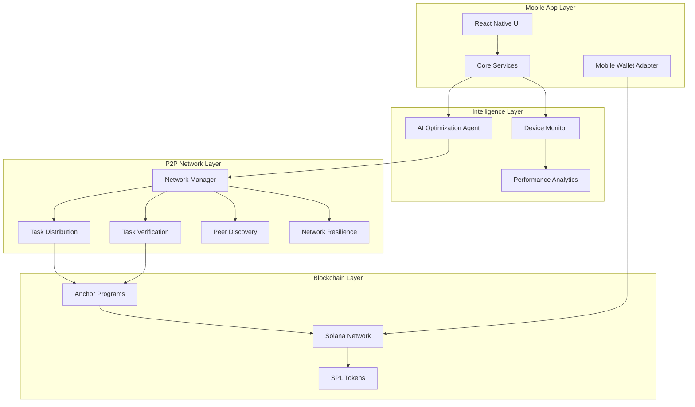

# SolanaWorks

> **Decentralized Mobile Compute Network Powered by AI**

[](https://solana.com/)
[](https://reactnative.dev/)
[](https://www.typescriptlang.org/)
[](https://coinmarketcap.com/academy/article/what-is-depin)
[](https://openai.com/)

## 🌟 Overview

**SolanaWorks** is a revolutionary Decentralized Physical Infrastructure Network (DePIN) that transforms mobile devices into a distributed compute network. By combining **Solana blockchain**, **AI optimization**, and **peer-to-peer networking**, we create an ecosystem where users can monetize their device's idle compute power while contributing to a global decentralized infrastructure.

### 🎯 Tagline
*"Turn Your Phone Into a Crypto Powerhouse - Earn While You Sleep"*

---

## 🔥 Problem Statement

### The Mobile Compute Crisis
- **Massive Waste**: Billions of mobile devices sit idle with untapped computational power
- **Centralized Infrastructure**: Cloud computing is dominated by tech giants with high costs
- **Limited Monetization**: Users have no way to earn from their device capabilities
- **Resource Inefficiency**: Peak compute demands strain centralized systems
- **Digital Divide**: Expensive cloud services limit access to compute resources

### Current DePIN Limitations
- Most DePIN projects focus on specialized hardware
- High barriers to entry for average users
- Limited mobile-first solutions
- Poor user experience and complex setups
- Insufficient AI-driven optimization

---

## 💡 Solution Statement

**SolanaWorks** democratizes access to distributed computing by:

### 🚀 Core Innovation
1. **Mobile-First DePIN**: Turns everyday smartphones into compute nodes
2. **AI-Powered Optimization**: Intelligent resource allocation and task distribution
3. **Zero-Setup Required**: Seamless onboarding with Mobile Wallet Adapter
4. **Real-Time Monitoring**: Production-grade device performance tracking
5. **Tokenized Incentives**: Earn crypto rewards for contributing compute power

### 🎯 Value Propositions
- **For Users**: Passive income from device usage
- **For Developers**: Affordable, scalable compute resources
- **For Networks**: Decentralized, resilient infrastructure
- **For Ecosystem**: Sustainable tokenomics and governance

---

## ✨ Key Features

### 🏗️ **Phase 1: Foundation** ✅ COMPLETE
- [x] **Solana Integration**: Native blockchain connectivity with Mobile Wallet Adapter
- [x] **Smart Contracts**: Anchor-based DePIN protocols for device registration and rewards
- [x] **Mobile Architecture**: Cross-platform React Native foundation

### 📊 **Phase 2: Device Intelligence** ✅ COMPLETE
- [x] **Real-Time Monitoring**: Live CPU, memory, thermal, and network metrics
- [x] **Performance Analytics**: Historical trends and optimization insights
- [x] **Capability Detection**: Automatic device specifications and tier classification
- [x] **Battery Optimization**: Smart power management for sustained operation

### 🤖 **Phase 3: AI Integration** ✅ COMPLETE
- [x] **Solana Agent Kit**: AI-powered decision making for resource optimization
- [x] **Intelligent Task Management**: Automated task acceptance based on device state
- [x] **Dynamic Optimization**: Real-time performance tuning and resource allocation
- [x] **Predictive Analytics**: ML-driven workload forecasting

### 🌐 **Phase 4: P2P Network** ✅ COMPLETE
- [x] **WebRTC Networking**: Direct peer-to-peer communication
- [x] **DHT Task Distribution**: Kademlia-based decentralized task routing
- [x] **Byzantine Verification**: Multi-peer consensus for result validation
- [x] **Network Resilience**: Automatic failover and partition healing
- [x] **Security Layer**: Cryptographic signatures and threat detection

### 💰 **Phase 5: Token Economics** 🚧 IN PROGRESS
- [ ] **Dynamic Rewards**: Performance-based token distribution
- [ ] **Staking Mechanisms**: Node reputation and participation incentives
- [ ] **Governance System**: Decentralized network parameter management
- [ ] **Treasury Management**: Community-driven fund allocation

---

## 🏛️ Architecture Overview



### 📋 Component Breakdown

| Component | Purpose | Technology |
|-----------|---------|------------|
| **Device Monitor** | Real-time system metrics collection | Native React Native APIs |
| **AI Agent** | Intelligent optimization decisions | Solana Agent Kit + OpenAI |
| **P2P Network** | Decentralized task distribution | WebRTC + Kademlia DHT |
| **Verification** | Byzantine fault-tolerant consensus | Cryptographic signatures |
| **Blockchain** | Immutable records and payments | Solana + Anchor |

---

## 🛠️ Technology Stack

### **Core Framework**
- **React Native 0.76**: Cross-platform mobile development
- **Expo 52**: Development toolkit and deployment
- **TypeScript 5.0**: Type-safe development

### **Blockchain & Crypto**
- **Solana**: High-performance blockchain
- **Anchor**: Smart contract framework
- **Mobile Wallet Adapter**: Seamless wallet integration
- **SPL Tokens**: Custom token implementation

### **AI & Intelligence**
- **Solana Agent Kit**: AI-powered blockchain interactions
- **OpenAI Integration**: Advanced decision making
- **TensorFlow.js**: On-device ML capabilities

### **Networking & P2P**
- **WebRTC**: Peer-to-peer communication
- **Kademlia DHT**: Distributed hash table
- **TweetNaCl**: Cryptographic operations
- **Socket.io**: Real-time messaging

### **UI & Experience**
- **React Native Paper**: Material Design components
- **React Navigation**: Navigation framework
- **Victory Native**: Data visualization
- **Expo Vector Icons**: Icon library

---

## 🚀 Quick Start

### Prerequisites
- **Android Device/Emulator** (Primary platform)
- **Node.js 18+** and **Yarn**
- **Expo CLI** installed globally
- **Solana Wallet** (Phantom, Solflare, etc.)

### Installation

```bash
# Clone the repository
git clone https://github.com/your-org/solanaworks.git
cd solanaworks

# Install dependencies
yarn install

# Start development server
npx expo start --dev-client

# For Android
npx expo run:android

# For local building
npx eas build --profile development --platform android --local
```

### Configuration

1. **Environment Setup**
   ```bash
   cp .env.example .env
   # Configure your Solana RPC endpoints and API keys
   ```

2. **Wallet Integration**
   - Install a Solana Mobile wallet app
   - Connect your wallet through Mobile Wallet Adapter

3. **Development Build**
   - Use Expo custom development build (not Expo Go)
   - Enable developer mode on Android device

---

## 📱 User Experience

### Onboarding Flow
1. **Connect Wallet**: One-tap Solana wallet connection
2. **Device Registration**: Automatic capability detection
3. **Network Join**: Seamless P2P network integration
4. **Start Earning**: Begin contributing compute power

### Core Interactions
- **Real-time Dashboard**: Live device metrics and earnings
- **Task Management**: View active and completed compute tasks
- **Network Health**: Monitor P2P connectivity and performance
- **Earnings Tracker**: Track token rewards and performance stats

---

## 🏆 Competitive Advantages

### **Technical Innovation**
- First mobile-native DePIN with AI optimization
- Production-grade P2P networking on mobile
- Real-time device monitoring without mocks
- Byzantine fault-tolerant task verification

### **User Experience**
- Zero-knowledge blockchain interactions
- Passive income generation
- Battery-efficient operation
- Intuitive mobile interface

### **Economic Model**
- Sustainable tokenomics
- Performance-based rewards
- Community governance
- Low barriers to entry

---

## 🗺️ Roadmap

### **Q1 2024: Foundation** ✅
- [x] Core mobile app development
- [x] Solana blockchain integration
- [x] Device monitoring system

### **Q2 2024: Intelligence** ✅
- [x] AI agent integration
- [x] Performance analytics
- [x] Optimization algorithms

### **Q3 2024: Network** ✅
- [x] P2P networking layer
- [x] Task distribution system
- [x] Verification mechanisms

### **Q4 2024: Economics** 🚧
- [ ] Token economics implementation
- [ ] Governance framework
- [ ] Mainnet deployment

### **2025: Scale**
- [ ] Multi-platform expansion (iOS)
- [ ] Enterprise partnerships
- [ ] Advanced AI capabilities
- [ ] Global network optimization

---

## 🧪 Testing & Development

### **Running Tests**
```bash
# Unit tests
yarn test

# TypeScript checking
npx tsc --noEmit

# Lint checking
yarn lint

# Build verification
yarn build:local
```

### **Development Workflow**
1. **Feature Development**: Create feature branches
2. **Type Safety**: Ensure TypeScript compliance
3. **Testing**: Unit and integration tests
4. **Code Review**: Peer review process
5. **Deployment**: Automated builds with EAS

---

## 📖 Documentation

- **[Architecture Guide](./docs/ARCHITECTURE.md)**: Detailed system design
- **[API Reference](./docs/API.md)**: Complete API documentation
- **[Deployment Guide](./docs/DEPLOYMENT.md)**: Production deployment
- **[Contributing](./CONTRIBUTING.md)**: Development guidelines

---

## 🤝 Contributing

We welcome contributions from the community! Please read our [Contributing Guidelines](./CONTRIBUTING.md) before submitting PRs.

### **Development Setup**
1. Fork the repository
2. Create a feature branch
3. Make your changes
4. Add tests and documentation
5. Submit a pull request

---

## 📄 License

This project is licensed under the **MIT License** - see the [LICENSE](./LICENSE) file for details.

---

## 🌐 Connect With Us

- **Website**: [solanaworks.io](https://solanaworks.io)
- **Twitter**: [@SolanaWorks](https://twitter.com/solanaworks)
- **Discord**: [Join our community](https://discord.gg/solanaworks)
- **Documentation**: [docs.solanaworks.io](https://docs.solanaworks.io)

---

## 🙏 Acknowledgments

- **Solana Foundation** for blockchain infrastructure
- **Solana Mobile** for Mobile Wallet Adapter
- **OpenAI** for AI capabilities
- **React Native Community** for mobile framework
- **DePIN Alliance** for ecosystem support

---

<div align="center">

**Built with ❤️ for the Solana Hackathon**

*Empowering the future of decentralized infrastructure, one mobile device at a time.*

</div>
