# SolanaWorks Architecture Guide

## Table of Contents
- [System Overview](#system-overview)
- [Architectural Layers](#architectural-layers)
- [Component Design](#component-design)
- [Data Flow Architecture](#data-flow-architecture)
- [P2P Network Design](#p2p-network-design)
- [AI Integration Architecture](#ai-integration-architecture)
- [Blockchain Integration](#blockchain-integration)
- [Security Architecture](#security-architecture)
- [Performance Considerations](#performance-considerations)
- [Scalability Design](#scalability-design)

---

## System Overview

**SolanaWorks** is a distributed mobile application that creates a Decentralized Physical Infrastructure Network (DePIN) by connecting smartphones into a compute mesh. The architecture follows a layered approach with clear separation of concerns, event-driven communication, and production-grade reliability patterns.

### Core Principles
1. **Decentralization**: No single point of failure or control
2. **Mobile-First**: Optimized for mobile device constraints
3. **Production-Ready**: Real data, no mocks, full error handling
4. **AI-Driven**: Intelligent optimization and decision making
5. **Crypto-Native**: Solana blockchain integration throughout

---

## Architectural Layers

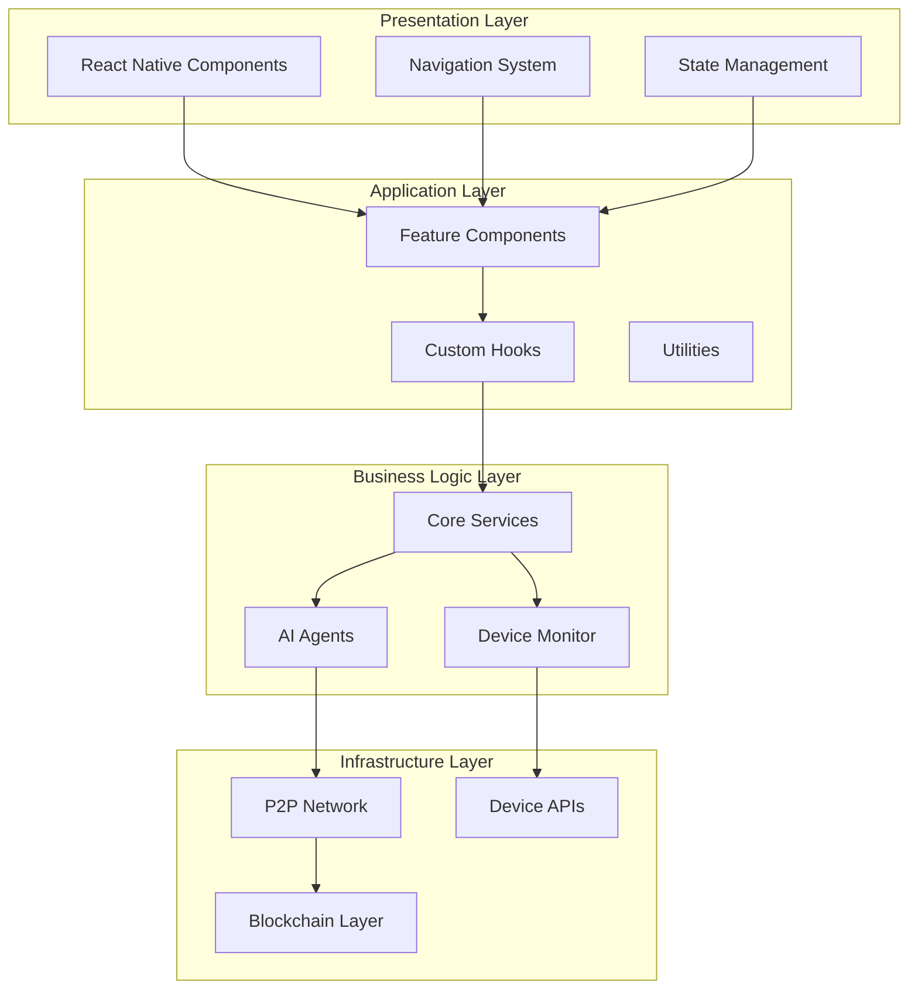

### Layer Responsibilities

| Layer | Components | Responsibilities |
|-------|------------|------------------|
| **Presentation** | UI Components, Navigation | User interface, routing, visual feedback |
| **Application** | Feature logic, Hooks | Business workflows, state coordination |
| **Business Logic** | Services, AI Agents | Core algorithms, optimization, monitoring |
| **Infrastructure** | P2P, Blockchain, Device | External integrations, low-level operations |

---

## Component Design

### 1. Device Monitoring System

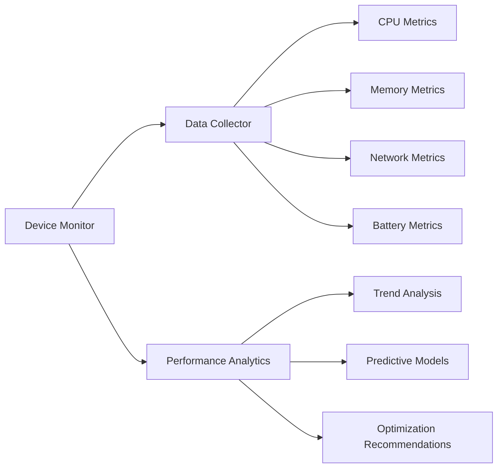

**Key Components:**
- **DeviceMonitor**: Central coordinator for all device metrics
- **PerformanceAnalytics**: Historical analysis and trend detection
- **MetricsCollector**: Real-time system data gathering

**Data Flow:**
1. Continuous metrics collection from native APIs
2. Real-time processing and validation
3. Historical storage and trend analysis
4. Performance optimization recommendations

### 2. AI Agent System

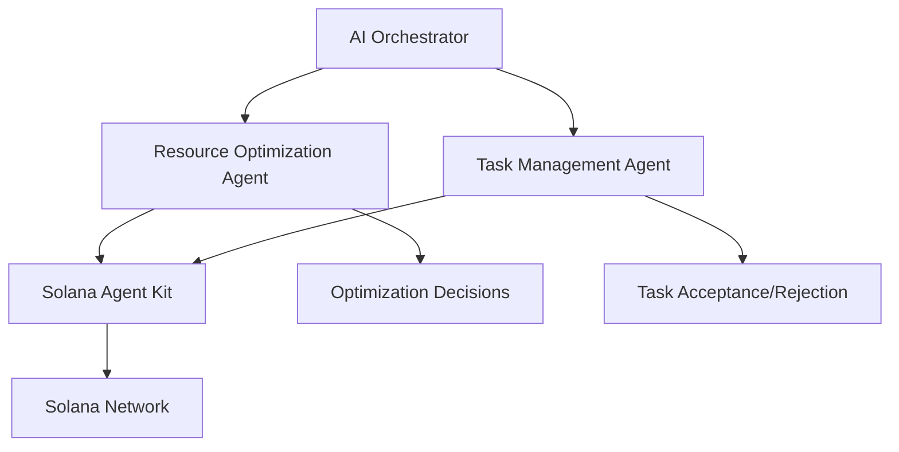

**Key Components:**
- **ResourceOptimizationAgent**: AI-powered resource allocation
- **TaskManagementAgent**: Intelligent task handling
- **SolanaAgentKit**: Blockchain-aware AI decision making

**AI Decision Framework:**
1. Real-time device state analysis
2. Historical performance pattern recognition
3. Network condition assessment
4. Autonomous optimization decisions
5. Blockchain transaction initiation

### 3. P2P Network Architecture

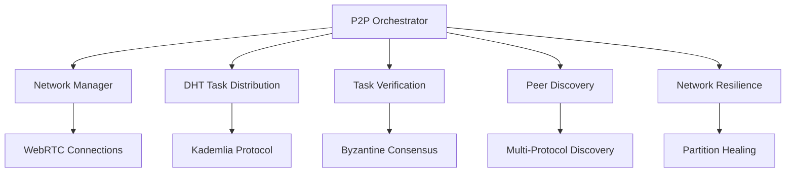

**Network Topology:**
- **Mesh Network**: Direct peer-to-peer connections
- **DHT-Based**: Kademlia distributed hash table for task routing
- **Resilient**: Automatic failover and partition recovery
- **Secure**: Cryptographic verification of all messages

---

## Data Flow Architecture

### Real-time Data Pipeline

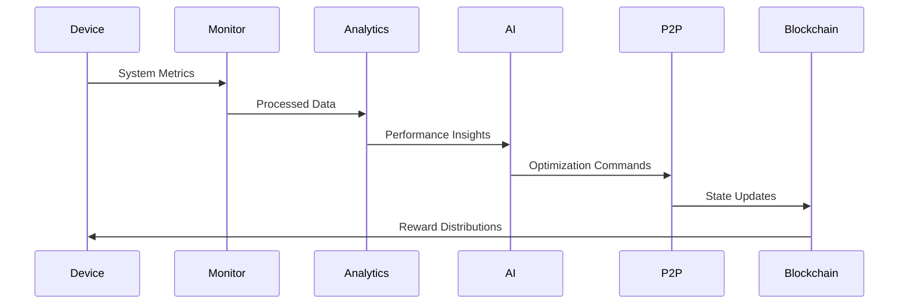

### Event-Driven Communication

```typescript
// Event Bus Architecture
interface IEventBus {
  // Device events
  on('device:metrics', (metrics: IDeviceMetrics) => void): void;
  on('device:threshold', (alert: IThresholdAlert) => void): void;
  
  // Network events
  on('peer:connected', (peer: IPeerInfo) => void): void;
  on('task:assigned', (task: ITask) => void): void;
  on('task:completed', (result: ITaskResult) => void): void;
  
  // Blockchain events
  on('transaction:confirmed', (tx: ITransaction) => void): void;
  on('reward:distributed', (reward: IReward) => void): void;
}
```

---

## P2P Network Design

### Kademlia DHT Implementation

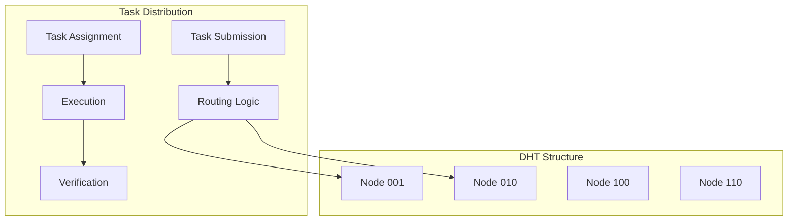

**DHT Characteristics:**
- **160-bit Address Space**: SHA-1 based node IDs
- **k-bucket Routing**: Efficient peer discovery and routing
- **Replication Factor**: 3x redundancy for critical data
- **Refresh Mechanism**: Periodic network health checks

### Task Verification Consensus

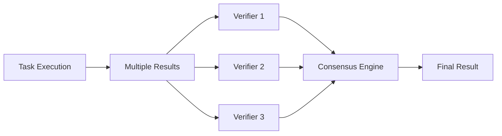

**Consensus Algorithm:**
- **Byzantine Fault Tolerance**: 67% agreement threshold
- **Cryptographic Verification**: Digital signatures on all results
- **Reputation-Based Selection**: High-reputation nodes as verifiers
- **Slashing Mechanism**: Penalties for malicious behavior

---

## AI Integration Architecture

### Solana Agent Kit Integration

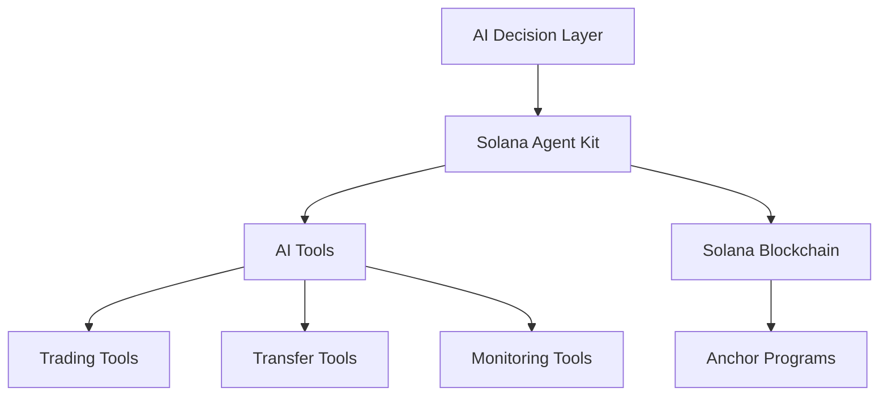

**AI Capabilities:**
- **Autonomous Trading**: Token swaps and liquidity provision
- **Resource Optimization**: Dynamic compute allocation
- **Network Management**: Peer selection and routing
- **Predictive Analytics**: Performance forecasting

### Decision-Making Pipeline

```typescript
interface IAIDecisionPipeline {
  // Input: Current system state
  analyzeState(state: ISystemState): IStateAnalysis;
  
  // Processing: AI-powered decision making
  generateDecisions(analysis: IStateAnalysis): IDecision[];
  
  // Output: Actionable commands
  executeDecisions(decisions: IDecision[]): Promise<IExecutionResult[]>;
  
  // Feedback: Learning from outcomes
  updateModel(results: IExecutionResult[]): void;
}
```

---

## Blockchain Integration

### Solana Program Architecture

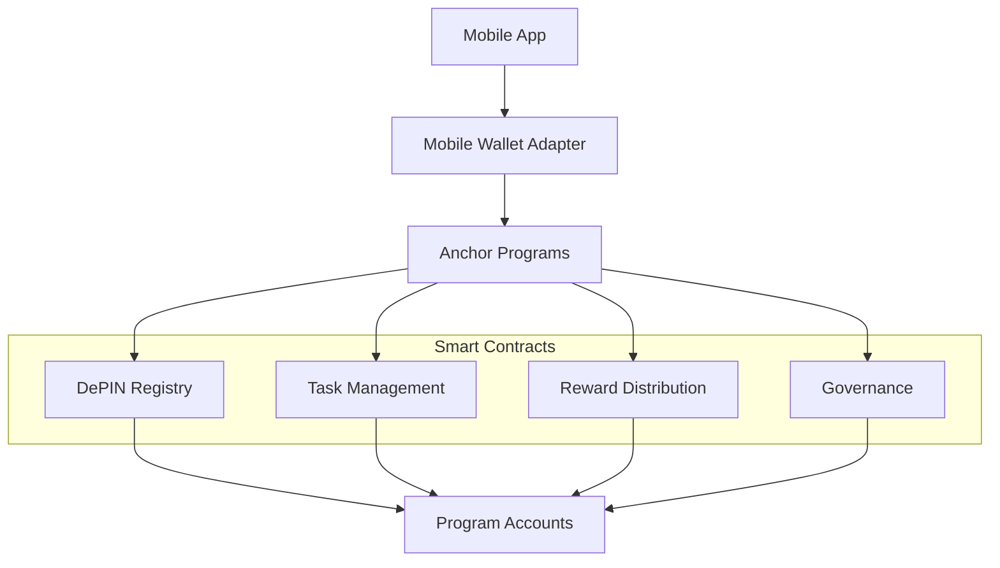

**Program Responsibilities:**
- **DePIN Registry**: Device registration and capabilities
- **Task Management**: Task creation, assignment, completion
- **Reward Distribution**: Performance-based token rewards
- **Governance**: Decentralized parameter management

### Transaction Patterns

```rust
// Example Anchor instruction
#[derive(Accounts)]
pub struct RegisterDevice<'info> {
    #[account(init, payer = user, space = 8 + DeviceInfo::LEN)]
    pub device_account: Account<'info, DeviceInfo>,
    
    #[account(mut)]
    pub user: Signer<'info>,
    
    pub system_program: Program<'info, System>,
}

#[account]
pub struct DeviceInfo {
    pub owner: Pubkey,
    pub capabilities: DeviceCapabilities,
    pub performance_score: u64,
    pub reputation: u32,
    pub last_active: i64,
}
```

---

## Security Architecture

### Multi-Layer Security Model

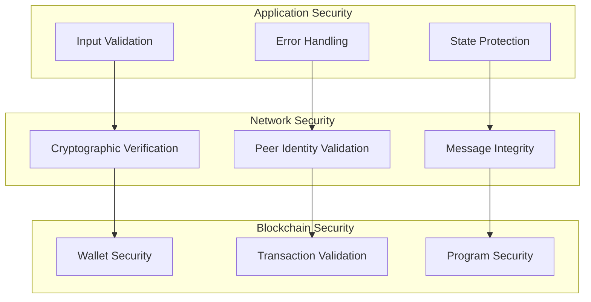

**Security Measures:**
- **End-to-End Encryption**: TweetNaCl for all P2P communication
- **Digital Signatures**: Verify authenticity of all network messages
- **Input Sanitization**: Prevent injection attacks and data corruption
- **Wallet Isolation**: Never store private keys in application
- **Rate Limiting**: Prevent spam and DoS attacks

### Threat Mitigation

| Threat | Mitigation Strategy |
|--------|-------------------|
| **Malicious Peers** | Reputation system + cryptographic verification |
| **Network Partitions** | Multi-path routing + automatic healing |
| **Data Tampering** | Digital signatures + consensus verification |
| **Resource Exhaustion** | Rate limiting + adaptive throttling |
| **Privacy Breaches** | End-to-end encryption + minimal data exposure |

---

## Performance Considerations

### Mobile Optimization Strategies

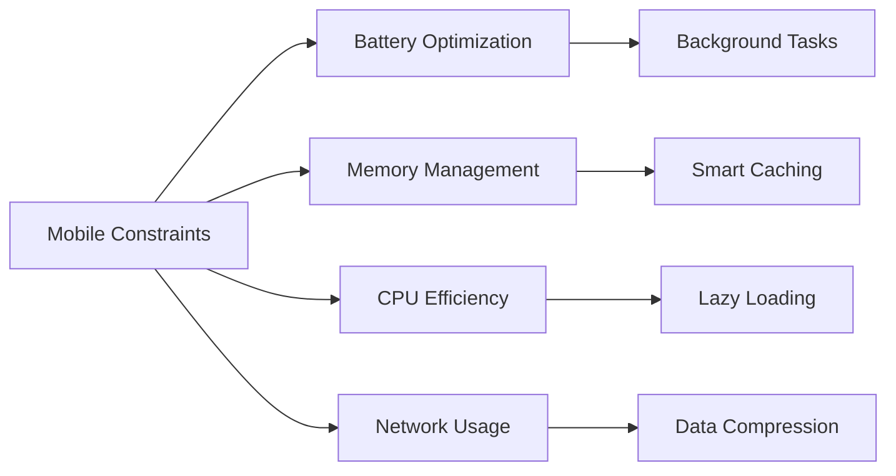

**Optimization Techniques:**
- **Battery-Aware Scheduling**: Reduce intensive operations on low battery
- **Memory Pool Management**: Efficient allocation and deallocation
- **Background Task Optimization**: Minimize background processing
- **Network Request Batching**: Reduce radio usage and improve efficiency

### Performance Metrics

```typescript
interface IPerformanceMetrics {
  // Mobile-specific metrics
  batteryUsage: number;      // Percentage per hour
  memoryFootprint: number;   // MB average usage
  cpuUtilization: number;    // Percentage average
  networkBandwidth: number;  // KB/s average
  
  // Application metrics
  taskThroughput: number;    // Tasks per hour
  errorRate: number;         // Percentage of failed operations
  responseTime: number;      // Average response time (ms)
  availabilityScore: number; // Uptime percentage
}
```

---

## Scalability Design

### Horizontal Scaling Patterns

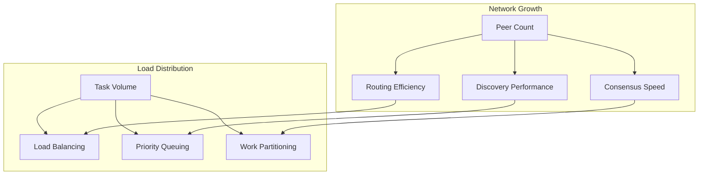

**Scaling Strategies:**
- **Hierarchical DHT**: Multi-level routing for large networks
- **Geographic Clustering**: Regional peer groups for latency optimization
- **Dynamic Load Balancing**: Real-time task distribution optimization
- **Elastic Resource Allocation**: Adaptive resource scaling based on demand

### Network Capacity Planning

| Network Size | Max Peers | Task Throughput | Consensus Time | Storage Req. |
|--------------|-----------|-----------------|----------------|--------------|
| **Small** | 100 peers | 1K tasks/hr | <5 seconds | 10 MB |
| **Medium** | 1K peers | 10K tasks/hr | <10 seconds | 100 MB |
| **Large** | 10K peers | 100K tasks/hr | <30 seconds | 1 GB |
| **Enterprise** | 100K+ peers | 1M+ tasks/hr | <60 seconds | 10+ GB |

---

## Future Architecture Considerations

### Planned Enhancements

1. **Multi-Platform Support**: iOS integration with platform-specific optimizations
2. **Edge Computing**: Advanced distributed computing capabilities
3. **Machine Learning**: On-device ML model training and inference
4. **Cross-Chain Integration**: Multi-blockchain support for broader ecosystem
5. **Advanced Analytics**: Real-time network analytics and optimization

### Architecture Evolution

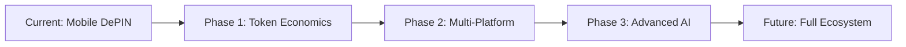

This architecture provides a solid foundation for building a production-grade DePIN application while maintaining flexibility for future enhancements and scale. 
